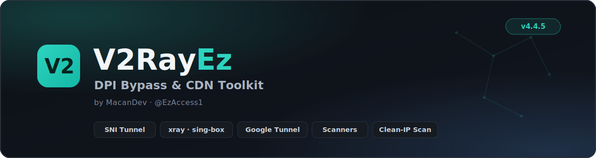
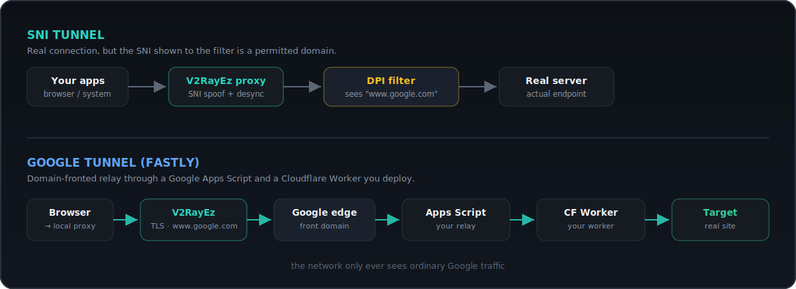

<a id="top"></a>
<div align="center">



<br>

[](#)
[](https://go.dev)
[](#)
[](https://t.me/EzAccess1)

**A single-binary local web panel to beat DPI filtering and work with CDN-fronted proxies.**

**🌐 Language / زبان —** [**English**](#english) · [**فارسی**](#persian)

</div>

> [!WARNING]
> **For education, testing, and research only.** You are responsible for obeying your
> local laws and the terms of any service you use it with (Google, Cloudflare, …).
> Provided **as is**, with no warranty.

---

<a id="english"></a>

## 🇬🇧 English

V2RayEz is a **single-binary local web control panel**. You run one executable, a clean
dashboard opens in your browser (or its own app window), and *everything* — an
SNI-spoofing tunnel, xray/sing-box engines, scanners, a config library, a
Google-fronted relay, and a client-side **domain-fronting** proxy — lives behind that one
page. No installer, no hidden services, no telemetry. It's Go with an embedded UI, so the
whole app is one portable file.

<div align="center">

</div>

### ✨ Features

| | Feature | What it does |
|---|---|---|
| ≋ | **SNI Tunnel** | Local TCP proxy that does the TLS handshake with a *fake* SNI while connecting to the real endpoint, with optional DPI-desync (fragmentation, fake packets, uTLS fingerprints). |
| ⚙ | **XRay Core** | Detect/download **xray** & **sing-box**; run any config as a local **SOCKS5** proxy or a system-wide **TUN VPN**. Start/stop, flip TUN, and **Set/Clear the system proxy** from the header. |
| ◉ | **Domain Fronting** | Fully client-side domain fronting — a local MITM proxy reads each request's real Host and reaches the site's CDN edge behind an allowed front SNI. Editable host→front rules, **fronted DoH** resolution (bypasses poisoned DNS) with Cloudflare/Google/Quad9 presets, Set/Clear system proxy, direct pass-through for unmatched hosts, and live request/error logging. |
| ☷ | **Config Library** | Groups, subscriptions, the built-in SNI/Spoof list, paste & drag-drop, a **full structured v2ray editor**, QR sharing, **bulk relay + speed tests**, right-click menu, shift/multi-select — all auto-saved. |
| ◎ | **Scanners** | SNI scan, Mass SNI, **Clean IP Scanner**, CDN Edge test, CDN Configs builder, **Mass URI** tester, and a rebuilt **Site Scanner** (live progress, Cloudflare-first, Connect/Save). |
| ◈ | **Google Tunnel (Fastly)** | Domain-fronted relay through a **Google Apps Script** + **Cloudflare Worker** you deploy. Both scripts are generated in-app — no external repo involved. |
| ☁ | **Extras** | Cloudflare Worker maker, WinDivert management, Psiphon & SPlus tunnels. |
| 🎨 | **Modern UI** | Light & dark themes, readable fonts, fully fluid layout (phone → ultra-wide), collapsible log console, English & Persian. |

### 🚀 Quick start

```bash
# run a release build
./v2rayez            # Linux / macOS
v2rayez.exe          # Windows
```

Listens on `0.0.0.0:8765` by default and opens the dashboard. If it doesn't, visit
**http://127.0.0.1:8765**.

<details>
<summary><b>Build from source</b> (Go 1.22+)</summary>

```bash
git clone <your-fork-url> v2rayez
cd v2rayez
go build -o v2rayez .
./v2rayez

# cross-compile
GOOS=windows GOARCH=amd64 go build -o v2rayez.exe .
GOOS=darwin  GOARCH=arm64 go build -o v2rayez-mac .
GOOS=linux   GOARCH=amd64 go build -o v2rayez .

# optional transports behind build tags — flags go BEFORE the dot:
go build -tags "psiphon livekit" .        # correct
# go build . -tags psiphon                 # WRONG: "malformed import path -tags"
# tagged builds fetch deps first:
#   go get github.com/Psiphon-Labs/psiphon-tunnel-core/ClientLibrary/clientlib@latest
#   go get github.com/livekit/server-sdk-go/v2@latest
```

**Build every platform at once** (output in `dist/`, Windows `.exe` gets the app icon):

```bash
build-all.bat              # Windows - interactive: pick a tag profile (Standard / Psiphon / LiveKit / All), it fetches deps and builds
./build-all.sh             # macOS / Linux - standard
./build-all.sh psiphon     # with a build tag (fetches its deps automatically)
```
</details>

<details>
<summary><b>Command-line flags</b></summary>

| Flag | Default | Meaning |
| --- | --- | --- |
| `-addr` | `0.0.0.0:8765` | Address the panel listens on |
| `-open` | `true` | Open the dashboard on start |
| `-window` | `true` | Use a dedicated app window if available |
| `-minimize` | `true` | Minimize the console window on Windows |

```bash
./v2rayez -addr 127.0.0.1:8765 -open=false -window=false   # local only
```
</details>

### 🧭 How it works

<div align="center">

</div>

Most basic DPI blocks by reading the **SNI** sent in the clear during the TLS handshake.
V2RayEz connects to the real server but writes a *permitted* hostname into that field, so
the filter sees an allowed domain while your real session continues. The **Domain
Fronting** tab takes this further for CDN-hosted sites: a local MITM proxy reads the real
Host, resolves it via fronted DoH (so poisoned DNS is never used), then reaches the CDN
edge behind an allowed front SNI — the network only sees ordinary traffic to the front.

### 📚 Using the tabs

<details>
<summary><b>Config Library</b> (default tab)</summary>

- Make **groups**; add configs by pasting `vless:// vmess:// trojan:// ss://`, dragging a
  `.txt`, importing a **subscription URL**, **Load SNI Configs**, or **Get latest**.
- **Connect** (green) runs a config through the engine chosen in XRay Core.
- **Right-click** a row or selection → Connect / Test / Speed test / Share / Edit / Copy /
  Delete. `Ctrl/⌘-click` + `Shift-click` to multi-select, `Ctrl/⌘-A` all, `Enter` connects.
- **Edit** opens a structured editor (address, port, UUID/password, cipher, transport,
  path, host header, security, SNI, fingerprint, ALPN, Reality keys) with a live preview.
</details>

<details>
<summary><b>Domain Fronting</b></summary>

- **Rules**: one per line, `host-suffix = front-SNI`, or `host-suffix = front-SNI = dial-host`
  to also redirect the TCP connection (needed for some CDNs). With no dial-host it connects
  to the real IP and only swaps the SNI. A built-in set ships ready to use.
- **DoH**: real hosts are resolved over a fronted DoH server so a censor's poisoned DNS
  (e.g. a `10.10.34.x` blackhole) is never used. Switch between Cloudflare / Google / Quad9
  presets, or set your own.
- **Default front** blank = unmatched hosts pass straight through (direct, no interception).
- **Set / Clear System Proxy** points the OS at the proxy and back.
- Trust the downloadable **CA** (`.pem` / `.crt`) so the proxy can read your HTTPS locally;
  the private key never leaves your machine.
- The activity console logs each new host and every error, so you can see what works.

> Fronting only helps sites already on a CDN that tolerates a mismatched SNI/Host, and it
> defeats **SNI-based** blocking — not destination-**IP** blocking.
</details>

<details>
<summary><b>XRay Core · SNI Tunnel · Google Tunnel</b></summary>

- **XRay Core** — detect/download engines, connect a config, pick **xray (SOCKS5)** or
  **sing-box (TUN VPN)**, Start. TUN / Start-Stop / system-proxy controls live in the header.
- **SNI Tunnel** — listen port + target + one or more **fake SNI**, a mode and optional
  desync, plus relay test, single-config test, and your **Saved SNI list**.
- **Google Tunnel (Fastly)** — ① generate `worker.js` + `Code.gs` in-app, ② deploy them to
  Cloudflare & Google Apps Script and copy the Deployment ID, ③ paste it + auth key, pick a
  **front preset**, Start, ④ point your proxy at `127.0.0.1:8086` and install the CA.
</details>

### ⚠️ Notes & limits

- **TUN** and **WinDivert** need administrator / root.
- **System proxy** uses native tooling per OS (Windows registry + WinINET, macOS
  `networksetup`, GNOME `gsettings`), with local/LAN ranges bypassed.
- Fronting depends on the target sharing a CDN edge with an allowed front; CDNs that strictly
  enforce SNI = Host (and self-hosted services) can't be fronted. It beats SNI blocking, not
  IP blocking.

### 🙌 Credits

Built by **MacanDev** · [@EzAccess1](https://t.me/EzAccess1). The Google Tunnel concept is
inspired by the MasterHttpRelay / mhr-cfw approach, and the client-side domain-fronting tab
is V2RayEz's own implementation of the technique documented by **patterniha**.


### 💖 Donate

If V2RayEz helps you, a donation keeps development and servers alive. Thank you! 🙏

| Coin | Network | Address |
|------|---------|---------|
| **Bitcoin** | BTC | `bc1qa7wtepdm5gqkn90mzv7n80p8uguay62la3aa3t` |
| **Ethereum** | ERC-20 | `0x449945E00c1Ad50B0705547677Bbf6E34f16698A` |
| **Solana** | SOL | `Fmis7BhiuHqVDnPeSAQ4VeUfEoY3KafpgbCt4VTGm6MZ` |
| **BNB** | BEP-20 | `0x449945E00c1Ad50B0705547677Bbf6E34f16698A` |
| **TRON** | TRX | `TU1svYx5YeeBz1bWCkJWYNx6oGE8WukWJ5` |
| **USDT** | TRC-20 | `TU1svYx5YeeBz1bWCkJWYNx6oGE8WukWJ5` |
| **USDT** | BEP-20 | `0x449945E00c1Ad50B0705547677Bbf6E34f16698A` |
| **USDT** | ERC-20 | `0x449945E00c1Ad50B0705547677Bbf6E34f16698A` |

<div align="right"><a href="#top">↑ back to top</a></div>

---

<a id="persian"></a>

<div dir="rtl" align="right">

## 🇮🇷 فارسی

V2RayEz یک **پنل کنترل وب محلیِ تک‌فایلی** است. یک فایل اجرایی را اجرا می‌کنید، یک داشبورد
تمیز در مرورگر (یا پنجرهٔ اختصاصی خودش) باز می‌شود و *همه‌چیز* — تونل اسپوف SNI، موتورهای
xray/sing-box، اسکنرها، کتابخانهٔ کانفیگ، رلهٔ فرانت‌شده با گوگل و یک پروکسی **دامین‌فرانتینگ**
سمت کلاینت — پشت همان یک صفحه است. بدون نصب‌کننده، بدون سرویس مخفی و بدون تله‌متری. با Go و
رابط تعبیه‌شده نوشته شده، پس کل برنامه یک فایل قابل‌حمل است.

<div align="center">

</div>

### ✨ ویژگی‌ها

| | ویژگی | توضیح |
|---|---|---|
| ≋ | **تونل SNI** | پروکسی TCP محلی که دست‌دادن TLS را با SNI *جعلی* انجام می‌دهد در حالی که به مقصد واقعی وصل می‌شود، با ترفندهای اختیاری ضد‌DPI (تکه‌تکه‌کردن، پکت جعلی، اثرانگشت uTLS). |
| ⚙ | **XRay Core** | یافتن/دانلود **xray** و **sing-box**؛ اجرای هر کانفیگ به‌صورت پروکسی **SOCKS5** محلی یا **VPN سراسری TUN**. شروع/توقف، تغییر به TUN و **تنظیم/پاک‌کردن پروکسی سیستم** از نوار بالا. |
| ◉ | **دامین‌فرانتینگ** | فرانتینگ کاملاً سمت کلاینت — یک پروکسی MITM محلی Host واقعی هر درخواست را می‌خواند و پشت یک SNI فرانتِ مجاز به اِج CDN سایت می‌رسد. قواعد قابل‌ویرایش هاست→فرانت، resolve با **DoH فرانت‌شده** (دور زدن DNS مسموم) با پیش‌تنظیم‌های کلودفلر/گوگل/Quad9، تنظیم/پاک‌کردن پروکسی سیستم، عبور مستقیم برای هاست‌های بدون قاعده، و ثبت زندهٔ درخواست/خطا. |
| ☷ | **کتابخانهٔ کانفیگ** | گروه‌ها، اشتراک‌ها، لیست SNI/اسپوف داخلی، چسباندن و کشیدن‌ورها، **ویرایشگر کامل و ساختاریافتهٔ v2ray**، اشتراک QR، **تست‌های دسته‌ای رله + سرعت**، منوی راست‌کلیک و انتخاب چندتایی — همه خودکار ذخیره می‌شوند. |
| ◎ | **اسکنرها** | اسکن SNI، اسکن گروهی، **اسکنر IP تمیز**، تست اِج CDN، سازندهٔ CDN Configs، تستر **انبوه URI** و **اسکنر سایت** بازسازی‌شده (پیشرفت زنده، کلودفلر در صدر، اتصال/ذخیره). |
| ◈ | **تونل گوگل (Fastly)** | رلهٔ دامین‌فرانتینگ از طریق **Google Apps Script** و **Cloudflare Worker** که خودتان دیپلوی می‌کنید. هر دو اسکریپت داخل برنامه ساخته می‌شوند. |
| ☁ | **امکانات دیگر** | سازندهٔ Cloudflare Worker، مدیریت WinDivert، تونل‌های Psiphon و SPlus. |
| 🎨 | **رابط مدرن** | تم روشن و تیره، فونت‌های خوانا، چیدمان کاملاً واکنش‌گرا (موبایل تا اولترا‌واید)، کنسول لاگ جمع‌شونده، انگلیسی و فارسی. |

### 🚀 شروع سریع

```bash
# اجرای نسخهٔ آماده
./v2rayez            # لینوکس / مک
v2rayez.exe          # ویندوز
```

به‌صورت پیش‌فرض روی `0.0.0.0:8765` گوش می‌دهد و داشبورد را باز می‌کند. اگر باز نشد،
**http://127.0.0.1:8765** را باز کنید.

<details>
<summary><b>ساخت از سورس</b> (Go 1.22+)</summary>

```bash
git clone <your-fork-url> v2rayez
cd v2rayez
go build -o v2rayez .
./v2rayez

# کامپایل برای پلتفرم‌های دیگر
GOOS=windows GOARCH=amd64 go build -o v2rayez.exe .
GOOS=darwin  GOARCH=arm64 go build -o v2rayez-mac .
GOOS=linux   GOARCH=amd64 go build -o v2rayez .

# ترنسپورت‌های اختیاری پشت build tag
go build -tags "livekit psiphon" -o v2rayez .
```

**ساخت همهٔ پلتفرم‌ها با هم** (خروجی در `dist/`، آیکون برنامه روی `.exe` ویندوز قرار می‌گیرد):

```bash
build-all.bat     # روی ویندوز
./build-all.sh    # روی مک / لینوکس
```
</details>

### 🧭 چطور کار می‌کند

<div align="center">

</div>

بیشتر DPIهای ساده با خواندن **SNI** که هنگام دست‌دادن TLS آشکار فرستاده می‌شود مسدود
می‌کنند. V2RayEz به سرور واقعی وصل می‌شود اما یک نام میزبان *مجاز* در آن فیلد می‌نویسد. تب
**دامین‌فرانتینگ** این را برای سایت‌های روی CDN یک گام جلوتر می‌برد: یک پروکسی MITM محلی Host
واقعی را می‌خواند، آن را با DoH فرانت‌شده resolve می‌کند (تا DNS مسموم استفاده نشود) و پشت یک
SNI فرانتِ مجاز به اِج CDN می‌رسد — شبکه فقط ترافیک عادی به فرانت را می‌بیند.

### ⚠️ نکته‌ها و محدودیت‌ها

- **TUN** و **WinDivert** به ادمین/روت نیاز دارند.
- **پروکسی سیستم** از ابزار بومی هر سیستم‌عامل استفاده می‌کند (رجیستری + WinINET ویندوز،
  `networksetup` مک، `gsettings` گنوم)، و محدوده‌های محلی/LAN را دور می‌زند.
- فرانتینگ به این بستگی دارد که مقصد با یک فرانت مجاز روی همان اِج CDN باشد؛ CDNهایی که
  سخت‌گیرانه SNI = Host را اعمال می‌کنند (و سرویس‌های میزبانی‌شدهٔ مستقل) قابل فرانت نیستند. این
  روش مسدودسازی مبتنی بر SNI را دور می‌زند، نه مسدودسازی IP را.

### 🙌 سازندگان

ساختهٔ **MacanDev** · [@EzAccess1](https://t.me/EzAccess1). ایدهٔ تونل گوگل از رویکرد
MasterHttpRelay / mhr-cfw الهام گرفته شده، و تب دامین‌فرانتینگ سمت کلاینت پیاده‌سازی مستقل
V2RayEz از تکنیکی است که **patterniha** مستند کرده است.


### 💖 حمایت

اگر V2RayEz برایتان مفید بود، یک کمک مالی به ادامهٔ توسعه و سرورها کمک می‌کند. ممنون! 🙏

| ارز | شبکه | آدرس |
|------|---------|---------|
| **Bitcoin** | BTC | `bc1qa7wtepdm5gqkn90mzv7n80p8uguay62la3aa3t` |
| **Ethereum** | ERC-20 | `0x449945E00c1Ad50B0705547677Bbf6E34f16698A` |
| **Solana** | SOL | `Fmis7BhiuHqVDnPeSAQ4VeUfEoY3KafpgbCt4VTGm6MZ` |
| **BNB** | BEP-20 | `0x449945E00c1Ad50B0705547677Bbf6E34f16698A` |
| **TRON** | TRX | `TU1svYx5YeeBz1bWCkJWYNx6oGE8WukWJ5` |
| **USDT** | TRC-20 | `TU1svYx5YeeBz1bWCkJWYNx6oGE8WukWJ5` |
| **USDT** | BEP-20 | `0x449945E00c1Ad50B0705547677Bbf6E34f16698A` |
| **USDT** | ERC-20 | `0x449945E00c1Ad50B0705547677Bbf6E34f16698A` |

</div>

<div align="center"><sub>© MacanDev · V2RayEz v4.7.5</sub></div>
